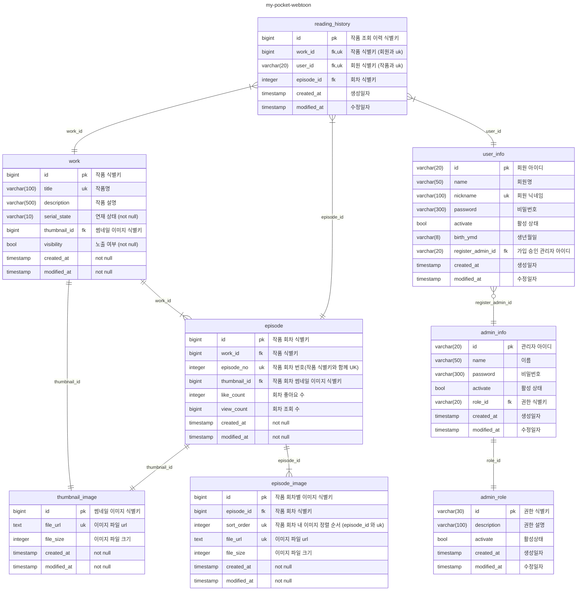

# my-pocket-webtoon-admin

[my-pocket-webtoon](https://github.com/GuardJo/my-pocket-webtoon) 서비스에 대한 어드민 서비스

> `my-pocket-webtoon`  내 작품 및 회원 관리를 위한 백오피스
>

# 인프라 구성

- DB : supabase (postgreSQL)
- 파일 스토리지 : cloudflare R2

# 모듈 구성

- spring boot 기반 (jdk 17)
- JPA (hibernate)
- JWT 토큰 기반 인증/인가 처리

# DB 스키마 구성

